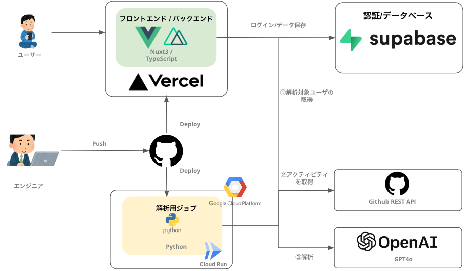

# CODE DNA

- [デモページ](https://code-dna.vercel.app/)

以下の QR コードからもアクセスできます。本アプリケーションはスマートフォンでの利用を推奨しています。


> [!WARNING]
> 本アプリケーションは、通知なく終了することがあります。

## 全体構成

本アプリケーションは Vercel にデプロイされており、データベース/認証には Supabase を使用しています。

全体構成は以下の通りです。


web アプリとジョブの詳細は、それぞれ以下の README.md を参照してください。

- [webapp](webapp/README.md)
- [analytics-job](analytics-job/README.md)

### 技術スタック

| 技術     | 利用用途                                                                            | URL                              |
| -------- | ----------------------------------------------------------------------------------- | -------------------------------- |
| Nuxt.js  | フロント/バックエンド                                                               | [Nuxt.js](https://nuxtjs.org/)   |
| Vercel   | サーバーのホスティング                                                              | [Vercel](https://vercel.com/)    |
| Supabase | データベースの永続化とユーザ認証                                                    | [Supabase](https://supabase.io/) |
| Open AI  | ユーザのエンジニアアイデンティティを分析                                            | [Open AI](https://openai.com/)   |
| GCP      | ユーザのエンジニアアイデンティティを解析処理を実施するジョブを Cloud Run にデプロイ | [GCP](https://cloud.google.com/) |

## 開発者向け

### 定期実行する

以下のコマンドで、10 秒おきにジョブを実行する

```bash
bash cron_job.sh
```
